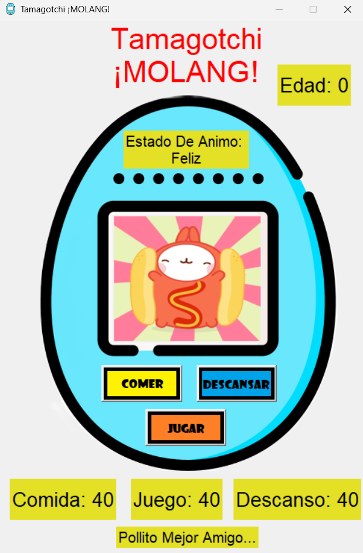
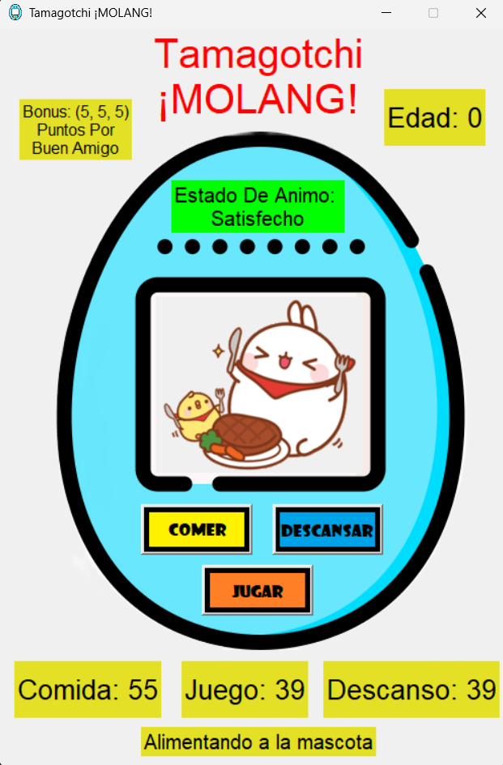
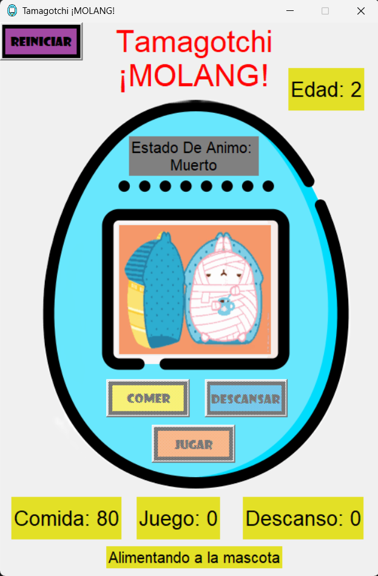

# Tamagotchi MOLANG!

A Tamagotchi created by me for fun, it's inspired in Molang! An animal like a bunny of one korean animation. Is beautiful and cute, and I like that. I hope you enjoy this mini project. Btw it's my first project using python, this is my first repositorie and first commits using git.

You need to download some external package, all of these packages are in requirements.txt, then you just have any version of python, a standar configuration of VS CODE that would run python well, and thats it, enjoy :D!

🔴 **This project is in spanish** 🔴


## Installation

Install my project with git clone

```bash
  git clone https://github.com/Norigamin/Tamagotchi.git
```

Then install the requirements

```bash
  pip install -r requirements.txt
```
Run the file tamagotchi.py and Enjoy!
    
## Demo










## Authors

- [@Norigamin](https://github.com/Norigamin)

